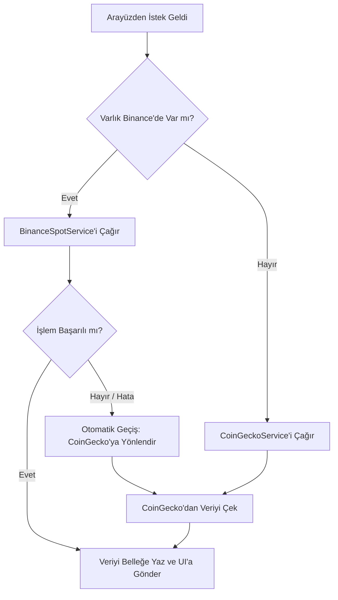
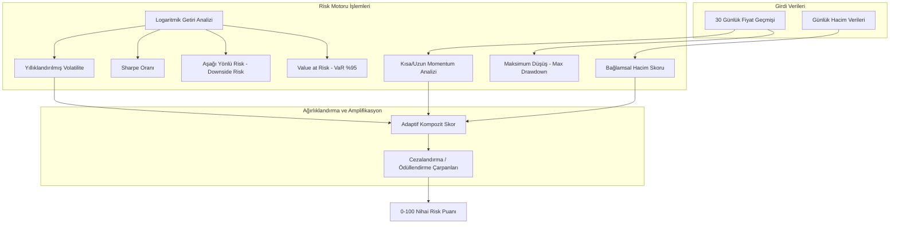

# 📊 Kripto Risk Analiz Aracı: Mimari, Özellikler ve Çalışma Raporu

Bu doküman, **CryptoRiskAnalysis** uygulamasının mimari özelliklerini, kullanılan teknolojilerin seçim nedenlerini ve arka planda çalışan matematiksel/algoritmik mekanizmaların nasıl işlediğini detaylı ve kapsamlı bir şekilde açıklamaktadır. Bu rapor, projenin akademik veya endüstriyel sunumlarında **temel referans (base report)** olarak kullanılmak üzere hazırlanmıştır.

---

## 🛠️ Mimari ve Teknoloji Seçimleri (Neden Seçildiler?)

Uygulama, yüksek performanslı finansal veri analizi yapabilmek, API kısıtlamalarını aşabilmek ve modern bir kullanıcı deneyimi sunabilmek için **Clean Architecture (Temiz Mimari)** ve **Full-Stack** bir model üzerine kurulmuştur.

| Katman / Bileşen | Kullanılan Teknoloji / Kütüphane | Seçim Nedeni |
| :--- | :--- | :--- |
| **Backend Core** | **.NET 8 (C#)** | Yüksek işlem performansı, güçlü tip güvenliği (Type Safety), asenkron programlama yetenekleri ve kurumsal mimari standartlarına tam uyum sağlaması. |
| **Frontend Core** | **React 19 & TypeScript & Vite** | Hızlı arayüz güncellemeleri (Virtual DOM), statik tip denetimi ile hata payının azaltılması ve Vite'in sağladığı yıldırım hızındaki geliştirme/derleme süresi. |
| **Veri Görselleştirme** | **Recharts (React)** | Finansal grafikleri çizmek için SVG tabanlı, duyarlı (responsive) ve dinamik olarak güncellenebilen performanslı bir kütüphane olması. |
| **Hata Toleransı** | **Polly (C#)** | Dış servis bağlantılarında geçici hataları ve hız sınırlarını (Rate Limit - 429) otomatik yönetmek amacıyla endüstri standardı olması. |
| **Önbellek Mekanizması**| **IMemoryCache (.NET)** | Dış API'lere bağımlılığı azaltarak gecikme sürelerini (latency) milisaniye seviyesine indirmek ve API engellemelerini önlemek. |
| **Global Hata Yönetimi**| **Custom Middleware (C#)** | API hatalarını standartlaştırmak, güvenlik açıklarını (stack trace sızıntısı vb.) üretim ortamında gizlemek. |

---

## 🛰️ 1. Akıllı Veri Yönlendirme ve Hibrit Veri Servisi (Smart Routing)

### ❓ Nedir?
Sistem, kripto varlıkların fiyat ve hacim geçmişini tek bir kaynaktan çekmek yerine, iki büyük sağlayıcıyı (**Binance** ve **CoinGecko**) akıllıca birleştiren `HybridCryptoDataService` yapısını kullanır.



### 🎯 Neden Seçildi?
*   **Rate Limit (Hız Sınırı) Engelleri:** Ücretsiz CoinGecko API'leri dakikada yalnızca 10-30 isteğe izin verir ve yoğun kullanımda doğrudan `429 Too Many Requests` hatası fırlatır. Binance Spot API'si ise dakikada 1200 isteğe kadar son derece cömert bir sınır sunar.
*   **Veri Tazeliği:** Binance, anlık emir defterleri ve anlık mum verileri (OHLCV) ile saniyelik veri sağlayabilirken; CoinGecko geçmiş odaklı veri sunar.
*   **Hata Toleransı (Graceful Degradation):** Binance'de listelenmeyen daha az popüler varlıklar (stablecoin'ler veya bazı altcoin'ler) için sistem durmaz, otomatik olarak CoinGecko üzerinden sorguyu tamamlar.

### ⚙️ Nasıl Çalışır?
1.  **Sembol Eşleme (`BinanceSymbolMapper`):** CoinGecko ID'lerini (örn. `ethereum`) Binance işlem çiftlerine (örn. `ETHUSDT`) çevirir.
2.  **Yönlendirme Kararı:** `IsAvailableOnBinance` metodu çağrılır. Varlık Binance'de varsa `BinanceSpotService` üzerinden son 30 günlük günlük mumlar (`1d` interval) çekilir.
3.  **Hata Durumunda Hızlı Geçiş (Failover):** Eğer Binance API'si ağ hatası verir veya çökerse, `try-catch` mekanizması devreye girer. Hata loglanır ve sistem kullanıcıya hiçbir hata hissettirmeden anında `CoinGeckoService` üzerinden veriyi çekerek yanıt verir.

---

## ⚡ 2. Çok Katmanlı Bellek İçi Önbellekleme (In-Memory Caching)

### ❓ Nedir?
Uygulamanın RAM'i üzerinde çalışan, dış API isteklerini minimumda tutmak için kurgulanmış geçici hafıza yönetim sistemidir.

### 🎯 Neden Seçildi?
Finansal veri analiz panellerinde kullanıcılar genellikle aynı kripto para birimleri (BTC, ETH, SOL) arasında sıkça geçiş yaparlar ya da sayfayı yenilerler. Her yenilemede dış sunuculara gitmek:
*   API kotalarını anında tüketir.
*   Sunucu tepki süresini (Response Time) 1.5 - 2 saniye civarına çıkarır.
*   Uygulama maliyetlerini artırır.

### ⚙️ Nasıl Çalışır?
*   **Binance İçin 60 Saniye:** Binance verileri çok hızlı değiştiği için önbellek süresi **1 dakika** olarak ayarlanmıştır. Bu sayede kullanıcılar neredeyse canlıya yakın veri alırken sunucu gereksiz isteklerden korunur.
*   **CoinGecko İçin 180 Saniye:** CoinGecko'nun sıkı sınırlamaları nedeniyle buradaki önbellek süresi **3 dakika** olarak belirlenmiştir.
*   **Önbellek Anahtarı (Cache Key):** İstekler `binance_{symbol}_{days}` ve `market_data_{assetId}_{days}` şeklinde dinamik anahtarlarla RAM'de saklanır. Bir istek geldiğinde önce bu anahtar RAM'de sorgulanır (**Cache Hit**). Varsa doğrudan bellekten verilir (gecikme süresi < 5ms). Yoksa API'den çekilip belleğe yazılır (**Cache Miss**).

---

## 🧠 3. Gelişmiş Finansal Risk Analiz Motoru (`RiskAnalysisEngine`)

Projenin en kritik ve entelektüel sermayesini oluşturan kısımdır. Basit aritmetik ortalamalar yerine, gerçek finans dünyasında kullanılan matematiksel modelleri temel alır.



### 📊 Matematiksel Metrikler ve Hesaplama Yöntemleri

#### A. Logaritmik Getiriler (Log Returns)
Geleneksel yüzde değişimleri yerine, finans matematiğinde toplanabilirliği ve normal dağılıma yakınlığı sebebiyle **Logaritmik Getiri** yöntemi tercih edilmiştir.
$$\text{Getiri}_t = \ln\left(\frac{P_t}{P_{t-1}}\right)$$
*Bu yaklaşım sıfırın altına inmeyen fiyat hareketlerinde matematiksel kararlılık sağlar.*

#### B. Yıllıklandırılmış Volatilite (Annualized Volatility)
Logaritmik getirilerin standart sapması ($\sigma$) hesaplanır. Kripto para piyasaları 7/24 açık olduğu için bu değer yıllıklandırılırken geleneksel hisse senedi piyasalarındaki gibi 252 gün değil, **365 gün** baz alınır.
$$\sigma_{\text{yıllık}} = \sigma_{\text{günlük}} \times \sqrt{365}$$
*   **0% - 50% Volatilite:** Düşük/Orta Risk (Stablecoin'ler veya büyük hacimli varlıklar).
*   **50% - 100% Volatilite:** Yüksek Risk.
*   **100% ve üzeri:** Aşırı Risk (Memecoin'ler veya yüksek spekülatif varlıklar).

#### C. Sharpe Oranı (Sharpe Ratio)
Alınan birim risk başına elde edilen fazla getiriyi ölçer. Kripto dünyasında risksiz faiz oranı (Risk-Free Rate) değişken olduğu için modelde baz olarak %0 kabul edilmiştir.
$$\text{Sharpe} = \frac{\text{Ortalama Getiri}}{\text{Standart Sapma}} \times \sqrt{365}$$
*Pozitif Sharpe oranı yatırımın mantıklı olduğunu gösterirken, negatif Sharpe oranı riskin getiriye değmediğini ifade eder.*

#### D. Maksimum Düşüş (Maximum Drawdown - MDD)
Varlığın analiz dönemi boyunca gördüğü en yüksek zirveden (peak), en dip noktaya (trough) yaşadığı en büyük kayıp yüzdesidir. Yatırımcının karşılaşabileceği "en kötü senaryoyu" gösterir.
$$\text{MDD} = \max \left( \frac{\text{Zirve Fiyat} - \text{Dip Fiyat}}{\text{Zirve Fiyat}} \right) \times 100$$

#### E. Value at Risk (VaR %95)
95% güven düzeyinde, 1 günlük zaman diliminde yatırımcının karşılaşabileceği maksimum tarihi zararı gösterir.
*   **Nasıl Çalışır:** Tarihsel getiriler küçükten büyüğe sıralanır. Veri kümesi yeterince büyükse (örn. > 20 gün) en kötü %5'lik dilime karşılık gelen değer seçilir. Bu değer, "Tarihsel olarak 100 günde sadece 5 gün bu orandan daha büyük bir düşüş yaşanmıştır" güvencesini verir.

---

### 🎛️ Bağlamsal Hacim Analizi (`CalculateVolumeScore`)

Hacim, tek başına bir anlam ifade etmez; mutlaka fiyat hareketi ile bağdaştırılmalıdır. Motor, bu ilişkiyi şu senaryolarla analiz eder:

1.  **Panik Satışı (Panic Selling):** Fiyat son 7 günde %5'ten fazla düşerken, günlük hacim son 30 gün ortalamasının 1.5 katını aşmışsa, bu durum yoğun bir satış baskısı (kapitülasyon) anlamına gelir. Hacim risk skoru doğrudan yukarı çekilir.
2.  **Yalancı Yükseliş (Weak Rally):** Fiyat %5'ten fazla artarken hacim ortalamanın yarısının altına düşmüşse, yükselişin alıcılar tarafından desteklenmediği (sahte yükseliş) varsayılır. Bu durum trend dönüş riski yaratır ve risk skoru yükseltilir.
3.  **Düşük Likidite Riski (Slippage):** Hacim ortalamanın %30'unun altındaysa, büyük alım-satımlarda yüksek kayma (slippage) riski oluşur. Spekülatif manipülasyona açık hale gelen bu tahtalar yüksek risk olarak işaretlenir.

---

### 🧬 4. Adaptif Ağırlıklandırma ve Risk Katlaması (Risk Amplification)

### ❓ Nedir?
Farklı piyasa koşullarında risk faktörlerinin ağırlığını dinamik olarak değiştiren ve birden fazla riskin aynı anda oluşması durumunda cezalandırma uygulayan algoritmadır.

### 🎯 Neden Seçildi?
Statik ağırlıklı ortalamalar (örn: %40 Volatilite + %30 Trend + %30 Hacim) olağanüstü piyasa koşullarında doğru çalışmaz. Örneğin, bir kripto parada hacim sıfıra yaklaşmışsa ve fiyat manipülatif dalgalanıyorsa, bu varlığın riskinin astronomik olması gerekir.

### ⚙️ Nasıl Çalışır?
*   **Dinamik Ağırlık Değişimi:**
    *   Eğer Volatilite Skoru > 70 ise, volatilitenin genel kompozit skordaki ağırlığı otomatik olarak **%50**'ye çıkarılır.
    *   Eğer Trend Skoru aşırı sapma gösteriyorsa, trend ağırlığı **%45** yapılır.
*   **Risk Katlama Cezası (Systemic Penalty):**
    *   **3 Faktör de Yüksekse:** Volatilite, Trend ve Hacim risklerinin tümü birden 70 puanın üzerindeyse, kompozit skor **1.20 çarpanı (%20 ceza)** ile çarpılarak maksimum 100 olacak şekilde yukarı yuvarlanır.
    *   **2 Faktör Yüksekse:** Herhangi iki faktör eş zamanlı yüksekse **1.10 çarpanı (%10 ceza)** uygulanır.
*   **Güvenli Liman İndirimi (Risk Dampening):**
    *   Tüm risk faktörleri 30 puanın altındaysa (örn. stabilcoin'ler veya boğa piyasasındaki Bitcoin), kompozit skor **0.90 çarpanı (%10 indirim)** ile ödüllendirilir.

---

## 🛡️ 5. Global Hata ve Dayanıklılık Yönetimi (Polly & Middleware)

### ❓ Nedir?
Uygulamanın internet kesintileri, dış servis çökmeleri veya yazılımsal hatalar karşısında çökmesini engelleyen koruma kalkanlarıdır.

### 🎯 Neden Seçildi?
Dış API'lere bağımlı sistemlerde internet kopması veya karşı sunucunun geçici olarak hizmet verememesi durumlarında kullanıcıya ham hata ekranları (500 Internal Server Error, beyaz ekran vb.) göstermek profesyonel standartlara aykırıdır.

### ⚙️ Nasıl Çalışır?

#### A. Polly ile Üstel Geri Çekilme (Exponential Backoff)
`ServiceCollectionExtensions` içerisinde tanımlanan Polly politikası, dış HTTP isteklerini izler.
```csharp
private static IAsyncPolicy<HttpResponseMessage> GetRetryPolicy()
{
    return HttpPolicyExtensions
        .HandleTransientHttpError() // 5xx hataları ve ağ kopmaları
        .OrResult(msg => msg.StatusCode == System.Net.HttpStatusCode.TooManyRequests) // 429 Hız Sınırı
        .WaitAndRetryAsync(
            retryCount: 3,
            sleepDurationProvider: retryAttempt => TimeSpan.FromSeconds(Math.Pow(2, retryAttempt)) // 2s -> 4s -> 8s
        );
}
```
*Herhangi bir geçici hata veya hız limiti aşımında sistem hemen pes etmez. Önce 2 saniye, sonra 4 saniye, en son 8 saniye bekleyerek isteği 3 kez tekrarlar. Bu sayede mikro kesintiler kullanıcıya hiç yansıtılmaz.*

#### B. Global Exception Handling Middleware
Olası bir kontrol dışı hata durumunda `ExceptionHandlingMiddleware` devreye girer:
*   Gelen hatayı arka planda diske (`Serilog` kullanarak `Logs/` klasörüne) ve konsola loglar.
*   **Güvenlik Filtresi:** Uygulamanın çalıştığı ortam **Development (Geliştirme)** ise hata detayını ve `Stack Trace` bilgisini hata yönetimi amacıyla arayüze gönderir. Eğer ortam **Production (Canlı)** ise veri tabanı şifreleri veya kod yapısının sızmaması için detayları gizler, kullanıcıya temiz bir `"An error occurred while processing your request."` mesajı döner.
*   Tüm yanıtları `ApiResponse<T>` sarmalayıcısıyla standartlaştırarak React tarafının hatayı şık bir bildirim kutusunda göstermesini sağlar.

---

## 🧪 6. Matematiksel Doğrulama ve Birim Testleri (Unit Tests)

Risk motorunun doğruluğu, `CryptoRiskAnalysis.Tests` projesi altındaki zengin xUnit test senaryoları ile garanti altına alınmıştır.

*   `CalculateRisk_WithStablePrices_ReturnsLowVolatilityScore`: Fiyatın sabit kaldığı senaryoda volatilite ve kompozit risk skorunun beklendiği gibi düşük sınırda (0-30 aralığında) kaldığını doğrular.
*   `CalculateRisk_WithHighVolatility_ReturnsHighScore`: Fiyatın sürekli zikzak çizdiği dalgalı senaryoda risk puanının yüksek bölgeye tırmandığını teyit eder.
*   `CalculateRisk_WithInsufficientData_ReturnsDefaultScore`: 7 günden az veri geldiğinde motorun çökmediğini, güvenli varsayılan değer olan 50 nötr puanını döndürdüğünü doğrular.
*   `CalculateMaxDrawdown_WithSignificantDrop_ReturnsCorrectPercentage`: Peak-to-trough (zirveden dibe düşüş) algoritmasının matematiksel hassasiyetini doğrular (örn. 120 dolardan 90 dolara düşüşte tam %25 kayıp hesaplandığı test edilmiştir).
*   `CalculateRisk_EnsuresScoresBounded`: Girdi verileri ne kadar çılgınca veya manipülatif olursa olsun, üretilen tüm ara ve ana skorların kesinlikle **0 ile 100 arasında sınırlandırıldığını (bounded)** garanti eder (matematiksel taşma/NaN koruması).

---

> [!NOTE]  
> **Özetle;** CryptoRiskAnalysis projesi sadece fiyatları ekrana çizen bir uygulama değildir. Arka planda üst düzey finans matematiği kullanan, dış servis kesintilerine karşı yedekli ve Polly ile güçlendirilmiş, bellek içi önbellekleme sayesinde milisaniyeler seviyesinde yanıt veren, kurumsal standartlarda tasarlanmış profesyonel bir finansal risk analiz prototipidir.
